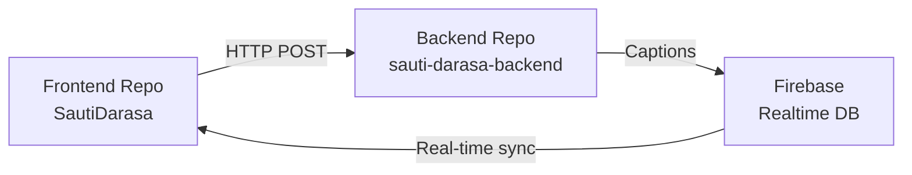

# Sauti Darasa Backend Implementation Plan

**Created**: January 1, 2026  
**Status**: Planning Phase  
**Objective**: Build Speech-to-Text transcription service for real-time classroom captioning  

---

## 🎯 Backend Requirements

### Primary Goal
Create a backend service that:
1. Receives audio chunks from the teacher's frontend (base64 encoded, 1.5-second intervals)
2. Transcribes audio using Google Cloud Speech-to-Text API
3. Publishes captions to Firebase Realtime Database
4. Handles real-time streaming with low latency (<2 seconds)

### Current Frontend Integration
- **Audio Format**: WebM/Opus (browser-dependent), base64 encoded
- **Chunk Size**: ~1.5 seconds of audio
- **Sample Rate**: 16kHz mono
- **Endpoint Expected**: `POST /api/transcribe?sessionId=<id>`
- **Request Body**: `{ "audioChunk": "base64-string" }`

---

## 🏗️ Architecture Options

### **Option 1: Cloud Run (Recommended) ✅**

**Pros**:
- Same platform as frontend (consistency)
- Better for stateful connections (WebSocket support)
- More flexible deployment (any runtime)
- Better for complex audio processing
- Cost-effective (pay per request)
- Easy scaling (0 to N instances)

**Cons**:
- Slightly more complex setup than Cloud Functions
- Requires containerization (already have Dockerfile experience)

**Best For**: Production deployment with growth potential

---

### **Option 2: Cloud Functions (Simpler Alternative)**

**Pros**:
- Simplest deployment (no Docker needed)
- Automatic scaling
- Built-in HTTP triggers
- Lower initial complexity

**Cons**:
- Cold start latency (~1-3 seconds)
- Limited execution time (9 minutes max)
- Less flexible for complex workflows
- Not ideal for streaming audio

**Best For**: Quick MVP or testing

---

### **Option 3: Cloud Functions + Pub/Sub (Advanced)**

**Pros**:
- Decoupled architecture
- Better error handling and retries
- Async processing (non-blocking)
- Can add multiple subscribers (analytics, storage, etc.)

**Cons**:
- More complex architecture
- Higher latency (message queuing overhead)
- More services to manage

**Best For**: Future scaling after MVP validation

---

## 📋 Recommended Implementation: Cloud Run

### Tech Stack
- **Runtime**: Python 3.11 (best Google Cloud Speech-to-Text SDK support)
- **Framework**: FastAPI (async support, automatic docs, type validation)
- **Speech-to-Text**: Google Cloud Speech-to-Text API v1 (streaming recognition)
- **Database**: Firebase Admin SDK for Realtime Database writes
- **Deployment**: Google Cloud Run (africa-south1, same region as frontend)

### Why Python + FastAPI?
- ✅ Native Google Cloud Speech-to-Text SDK
- ✅ Async/await for streaming audio
- ✅ Strong audio processing libraries (pydub, librosa if needed)
- ✅ Firebase Admin SDK official support
- ✅ FastAPI auto-generates OpenAPI docs
- ✅ Type hints for reliability

---

## 🛠️ Implementation Steps

### **Phase 1: Local Development Setup (Day 1)**

1. **Create Backend Directory Structure (Separate Repository)**

> **Note**: Backend is in a **separate directory and Git repository** from the frontend.
> This follows best practices for microservices architecture.

```bash
# Create new backend directory (outside frontend project)
cd /Users/mac/Desktop/GCP\ Projects/
mkdir sauti-darasa-backend
cd sauti-darasa-backend

# Initialize Git repository
git init
git branch -M main

# Directory structure
sauti-darasa-backend/              # NEW separate repository
├── app/
│   ├── __init__.py
│   ├── main.py              # FastAPI app entry point
│   ├── config.py            # Environment configuration
│   ├── transcription.py     # Speech-to-Text logic
│   ├── firebase_client.py   # Firebase Realtime DB client
│   └── models.py            # Pydantic request/response models
├── tests/
│   ├── __init__.py
│   ├── test_transcription.py
│   └── test_api.py
├── Dockerfile
├── .dockerignore
├── requirements.txt
├── .env                     # Local environment variables (gitignored)
├── .env.example             # Template for environment variables
├── .gitignore
├── deploy-backend.sh        # Deployment script
└── README.md
```

2. **Initialize Python Project**
```bash
# Create virtual environment
python3.11 -m venv venv
source venv/bin/activate

# Create requirements.txt
cat > requirements.txt << EOF
fastapi==0.115.0
uvicorn[standard]==0.32.0
google-cloud-speech==2.28.0
firebase-admin==6.6.0
pydantic==2.10.0
python-dotenv==1.0.1
pytest==8.3.3
httpx==0.27.0
EOF

# Install dependencies
pip install -r requirements.txt
```

3. **Set Up Environment Variables**
```bash
# Create .env file
cat > .env << EOF
# Google Cloud
GCP_PROJECT_ID=sauti-darasa
GCP_REGION=africa-south1
GOOGLE_APPLICATION_CREDENTIALS=./sauti-darasa-key.json

# Firebase
FIREBASE_DATABASE_URL=https://sautidarasa.firebaseio.com
FIREBASE_PROJECT_ID=sautidarasa

# API Configuration
API_HOST=0.0.0.0
API_PORT=8000
ALLOWED_ORIGINS=https://sauti-darasa-pwa-512236104756.africa-south1.run.app,http://localhost:5173

# Speech-to-Text Settings
SPEECH_LANGUAGE_CODE=en-KE  # Kenyan English
SPEECH_SAMPLE_RATE=16000
EOF
```

4. **Obtain Service Account Key**
```bash
# From GCP Console or gcloud
gcloud iam service-accounts keys create ./sauti-darasa-key.json \
  --iam-account=YOUR_SERVICE_ACCOUNT@sauti-darasa.iam.gserviceaccount.com

# Create .gitignore for backend
cat > .gitignore << EOF
# Python
__pycache__/
*.py[cod]
*$py.class
*.so
.Python
venv/
env/
ENV/

# Environment variables
.env
.env.local

# Service Account Keys (NEVER commit!)
*.json
!.env.example

# Testing
.pytest_cache/
.coverage
htmlcov/
*.log

# IDE
.vscode/
.idea/
*.swp
.DS_Store

# Build
dist/
build/
*.egg-info/
EOF

# Create README
cat > README.md << EOF
# Sauti Darasa Backend

Real-time Speech-to-Text transcription service for classroom captioning.

## Tech Stack
- Python 3.11 + FastAPI
- Google Cloud Speech-to-Text API
- Firebase Realtime Database
- Deployed on Google Cloud Run

## Setup
\`\`\`bash
# Create virtual environment
python3.11 -m venv venv
source venv/bin/activate  # On Windows: venv\Scripts\activate

# Install dependencies
pip install -r requirements.txt

# Configure environment
cp .env.example .env
# Edit .env with your credentials

# Run locally
uvicorn app.main:app --reload --port 8000
\`\`\`

## Deployment
\`\`\`bash
./deploy-backend.sh
\`\`\`

## API Documentation
Once running, visit: http://localhost:8000/docs

## Frontend Repository
https://github.com/Eli-Keli/SautiDarasa
EOF
```

---

### **Phase 2: Core Backend Implementation (Day 1-2)**

#### 1. **Create FastAPI Application (`app/main.py`)**

```python
from fastapi import FastAPI, HTTPException, Query
from fastapi.middleware.cors import CORSMiddleware
from app.config import settings
from app.models import TranscribeRequest, TranscribeResponse
from app.transcription import transcribe_audio
from app.firebase_client import publish_caption
import logging

# Configure logging
logging.basicConfig(level=logging.INFO)
logger = logging.getLogger(__name__)

app = FastAPI(
    title="Sauti Darasa Transcription API",
    description="Real-time speech-to-text for classroom captioning",
    version="1.0.0"
)

# CORS middleware
app.add_middleware(
    CORSMiddleware,
    allow_origins=settings.ALLOWED_ORIGINS,
    allow_credentials=True,
    allow_methods=["*"],
    allow_headers=["*"],
)

@app.get("/")
async def root():
    return {
        "service": "Sauti Darasa Transcription API",
        "status": "running",
        "version": "1.0.0"
    }

@app.get("/health")
async def health_check():
    return {"status": "healthy"}

@app.post("/api/transcribe", response_model=TranscribeResponse)
async def transcribe(
    request: TranscribeRequest,
    sessionId: str = Query(..., description="Classroom session ID")
):
    """
    Transcribe audio chunk and publish to Firebase.
    
    - Receives base64-encoded audio
    - Transcribes using Google Speech-to-Text
    - Publishes caption to Firebase Realtime Database
    """
    try:
        logger.info(f"Received transcription request for session: {sessionId}")
        
        # Transcribe audio
        transcript = await transcribe_audio(
            audio_base64=request.audioChunk,
            language_code=settings.SPEECH_LANGUAGE_CODE,
            sample_rate=settings.SPEECH_SAMPLE_RATE
        )
        
        if not transcript:
            logger.warning(f"No transcript generated for session: {sessionId}")
            return TranscribeResponse(
                success=True,
                transcript="",
                sessionId=sessionId
            )
        
        # Publish to Firebase
        await publish_caption(sessionId, transcript)
        
        logger.info(f"Transcription successful: {transcript[:50]}...")
        
        return TranscribeResponse(
            success=True,
            transcript=transcript,
            sessionId=sessionId
        )
        
    except Exception as e:
        logger.error(f"Transcription failed: {str(e)}")
        raise HTTPException(status_code=500, detail=str(e))
```

#### 2. **Create Configuration (`app/config.py`)**

```python
from pydantic_settings import BaseSettings
from typing import List

class Settings(BaseSettings):
    # Google Cloud
    GCP_PROJECT_ID: str
    GCP_REGION: str
    GOOGLE_APPLICATION_CREDENTIALS: str
    
    # Firebase
    FIREBASE_DATABASE_URL: str
    FIREBASE_PROJECT_ID: str
    
    # API Configuration
    API_HOST: str = "0.0.0.0"
    API_PORT: int = 8000
    ALLOWED_ORIGINS: List[str]
    
    # Speech-to-Text Settings
    SPEECH_LANGUAGE_CODE: str = "en-KE"
    SPEECH_SAMPLE_RATE: int = 16000
    
    class Config:
        env_file = ".env"
        case_sensitive = True

settings = Settings()
```

#### 3. **Create Data Models (`app/models.py`)**

```python
from pydantic import BaseModel, Field

class TranscribeRequest(BaseModel):
    audioChunk: str = Field(..., description="Base64-encoded audio data")

class TranscribeResponse(BaseModel):
    success: bool
    transcript: str
    sessionId: str
    error: str | None = None
```

#### 4. **Implement Speech-to-Text (`app/transcription.py`)**

```python
import base64
import io
from google.cloud import speech_v1 as speech
from app.config import settings
import logging

logger = logging.getLogger(__name__)

# Initialize Speech-to-Text client
speech_client = speech.SpeechClient()

async def transcribe_audio(
    audio_base64: str,
    language_code: str = "en-KE",
    sample_rate: int = 16000
) -> str:
    """
    Transcribe base64-encoded audio using Google Cloud Speech-to-Text.
    
    Args:
        audio_base64: Base64-encoded audio data (data:audio/...;base64,XXX)
        language_code: Language code (en-KE for Kenyan English)
        sample_rate: Audio sample rate in Hz
    
    Returns:
        Transcribed text or empty string if no speech detected
    """
    try:
        # Remove data URL prefix if present
        if "," in audio_base64:
            audio_base64 = audio_base64.split(",")[1]
        
        # Decode base64 to bytes
        audio_bytes = base64.b64decode(audio_base64)
        
        # Configure recognition request
        audio = speech.RecognitionAudio(content=audio_bytes)
        config = speech.RecognitionConfig(
            encoding=speech.RecognitionConfig.AudioEncoding.WEBM_OPUS,
            sample_rate_hertz=sample_rate,
            language_code=language_code,
            enable_automatic_punctuation=True,
            model="default",  # Use "video" model for classroom audio
            use_enhanced=True  # Use enhanced model for better accuracy
        )
        
        # Perform synchronous recognition
        response = speech_client.recognize(config=config, audio=audio)
        
        # Extract transcript
        transcripts = []
        for result in response.results:
            if result.alternatives:
                transcripts.append(result.alternatives[0].transcript)
        
        transcript = " ".join(transcripts).strip()
        
        if transcript:
            logger.info(f"Transcribed: {transcript}")
        else:
            logger.debug("No speech detected in audio chunk")
        
        return transcript
        
    except Exception as e:
        logger.error(f"Transcription error: {str(e)}")
        raise
```

#### 5. **Implement Firebase Client (`app/firebase_client.py`)**

```python
import firebase_admin
from firebase_admin import credentials, db
from app.config import settings
import logging

logger = logging.getLogger(__name__)

# Initialize Firebase Admin SDK
cred = credentials.Certificate(settings.GOOGLE_APPLICATION_CREDENTIALS)
firebase_admin.initialize_app(cred, {
    'databaseURL': settings.FIREBASE_DATABASE_URL
})

async def publish_caption(session_id: str, caption_text: str) -> None:
    """
    Publish caption to Firebase Realtime Database.
    
    Writes to: /captions/{sessionId}/latest
    
    Args:
        session_id: Classroom session ID
        caption_text: Transcribed text to publish
    """
    try:
        if not caption_text:
            logger.debug(f"Skipping empty caption for session: {session_id}")
            return
        
        ref = db.reference(f'captions/{session_id}/latest')
        ref.set({
            'text': caption_text,
            'timestamp': {'.sv': 'timestamp'}  # Firebase server timestamp
        })
        
        logger.info(f"Caption published to session {session_id}: {caption_text[:30]}...")
        
    except Exception as e:
        logger.error(f"Failed to publish caption: {str(e)}")
        raise
```

---

### **Phase 3: Testing (Day 2)**

#### 1. **Unit Tests (`tests/test_transcription.py`)**

```python
import pytest
from app.transcription import transcribe_audio
import base64

# Sample base64-encoded audio (1 second of silence - for testing)
SAMPLE_AUDIO_BASE64 = "data:audio/webm;base64,GkXfo59ChoEBQveBAULygQRC84EIQoKEd2VibUKHgQRChYECGFOAZwH/////////FUmpZpkq17GDD0JATYCGQ2hyb21lV0GGQ2hyb21lFlSua7+uvPEnU7t421OdgQKr4WgQVSalmU6m5AAFAAJBQhVYmJiZWQgbWVkaWEQdGltZRJwYXlsb2FkAAAAAAAAAA=="

@pytest.mark.asyncio
async def test_transcribe_audio_with_silence():
    """Test transcription with silent audio"""
    result = await transcribe_audio(
        audio_base64=SAMPLE_AUDIO_BASE64,
        language_code="en-US",
        sample_rate=16000
    )
    # Silent audio should return empty string
    assert isinstance(result, str)

@pytest.mark.asyncio  
async def test_transcribe_audio_invalid_base64():
    """Test transcription with invalid base64"""
    with pytest.raises(Exception):
        await transcribe_audio(
            audio_base64="invalid-base64",
            language_code="en-US",
            sample_rate=16000
        )
```

#### 2. **API Integration Tests (`tests/test_api.py`)**

```python
import pytest
from fastapi.testclient import TestClient
from app.main import app

client = TestClient(app)

def test_root_endpoint():
    """Test root endpoint returns service info"""
    response = client.get("/")
    assert response.status_code == 200
    assert "service" in response.json()

def test_health_check():
    """Test health check endpoint"""
    response = client.get("/health")
    assert response.status_code == 200
    assert response.json()["status"] == "healthy"

def test_transcribe_endpoint_missing_session_id():
    """Test transcribe endpoint without session ID"""
    response = client.post(
        "/api/transcribe",
        json={"audioChunk": "base64-data"}
    )
    assert response.status_code == 422  # Validation error

def test_transcribe_endpoint_with_session_id():
    """Test transcribe endpoint with valid request"""
    response = client.post(
        "/api/transcribe?sessionId=test-session-123",
        json={"audioChunk": "data:audio/webm;base64,GkXfo59ChoEBQveBAULygQRC84EIQo..."}
    )
    assert response.status_code in [200, 500]  # May fail without real audio
```

#### 3. **Run Tests**

```bash
# Run all tests
pytest tests/ -v

# Run with coverage
pip install pytest-cov
pytest tests/ --cov=app --cov-report=html
```

---

### **Phase 4: Docker Containerization (Day 2)**

#### Create `backend/Dockerfile`

```dockerfile
# Use official Python runtime
FROM python:3.11-slim

# Set working directory
WORKDIR /app

# Install system dependencies
RUN apt-get update && apt-get install -y \
    gcc \
    && rm -rf /var/lib/apt/lists/*

# Copy requirements and install Python dependencies
COPY requirements.txt .
RUN pip install --no-cache-dir -r requirements.txt

# Copy application code
COPY app/ ./app/
COPY sauti-darasa-key.json ./sauti-darasa-key.json

# Expose port
EXPOSE 8000

# Health check
HEALTHCHECK --interval=30s --timeout=3s --start-period=5s --retries=3 \
  CMD python -c "import requests; requests.get('http://localhost:8000/health')" || exit 1

# Run application
CMD ["uvicorn", "app.main:app", "--host", "0.0.0.0", "--port", "8000"]
```

#### Create `backend/.dockerignore`

```
__pycache__
*.pyc
*.pyo
*.pyd
.Python
venv/
.env
.pytest_cache/
.coverage
htmlcov/
*.log
.DS_Store
tests/
```

#### Test Locally

```bash
# Build Docker image
docker build -t sauti-darasa-backend .

# Run container locally
docker run -p 8000:8000 \
  -e GCP_PROJECT_ID=sauti-darasa \
  -e FIREBASE_DATABASE_URL=https://sautidarasa.firebaseio.com \
  sauti-darasa-backend

# Test endpoint
curl http://localhost:8000/health
```

---
frontend .env.gcloud with backend URL
# Navigate to frontend project
cd /Users/mac/Desktop/GCP\ Projects/SautiDarasa

# Edit .env.gcloud
nano .env.gcloud
# Replace: VITE_BACKEND_API_URL=https://sauti-darasa-backend-XXXXX.run.app

# Redeploy frontendsh
#!/bin/bash

set -e

echo "🚀 Deploying Sauti Darasa Backend to Cloud Run..."

# Configuration
PROJECT_ID="sauti-darasa"
REGION="africa-south1"
SERVICE_NAME="sauti-darasa-backend"
IMAGE_NAME="gcr.io/$PROJECT_ID/$SERVICE_NAME"

# Set project
gcloud config set project $PROJECT_ID

# Build and push image
echo "🏗️  Building Docker image..."
docker build --platform linux/amd64 -t $IMAGE_NAME .

echo "📤 Pushing to GCR..."
docker push $IMAGE_NAME

# Deploy to Cloud Run
echo "🚀 Deploying to Cloud Run..."
gcloud run deploy $SERVICE_NAME \
  --image $IMAGE_NAME \
  --platform managed \
  --region $REGION \
  --allow-unauthenticated \
  --memory 512Mi \
  --cpu 1 \
  --timeout 60s \
  --max-instances 10 \
  --set-env-vars "GCP_PROJECT_ID=$PROJECT_ID" \
  --set-env-vars "FIREBASE_DATABASE_URL=https://sautidarasa.firebaseio.com" \
  --set-env-vars "FIREBASE_PROJECT_ID=sautidarasa" \
  --set-env-vars "SPEECH_LANGUAGE_CODE=en-KE" \
  --set-env-vars "ALLOWED_ORIGINS=https://sauti-darasa-pwa-512236104756.africa-south1.run.app,http://localhost:5173"

# Get service URL
SERVICE_URL=$(gcloud run services describe $SERVICE_NAME --region $REGION --format 'value(status.url)')

echo ""
echo "✅ Deployment successful!"
echo "🌐 Backend URL: $SERVICE_URL"
echo ""
echo "Next steps:"
echo "  1. Update frontend .env.gcloud:"
echo "     VITE_BACKEND_API_URL=$SERVICE_URL"
echo "  2. Test endpoint: curl $SERVICE_URL/health"
echo "  3. Redeploy frontend with new backend URL"
```

#### 2. **Enable Speech-to-Text API**

```bash
gcloud services enable speech.googleapis.com --project=sauti-darasa
```

#### 3. **Deploy**

```bash
cd backend
chmod +x deploy-backend.sh
./deploy-backend.sh
```

#### 4. **Update Frontend Environment**

```bash
# Update .env.gcloud with backend URL
# Replace VITE_BACKEND_API_URL with the Cloud Run URL from deployment
nano ../.env.gcloud

# Redeploy frontend
cd ..
./deploy-cloud-run.sh
```

---

### **Phase 6: Testing End-to-End (Day 3)**

#### 1. **Test Backend Health**

```bash
BACKEND_URL="https://sauti-darasa-backend-XXXXX-uc.a.run.app"

# Health check
curl $BACKEND_URL/health

# API docs (FastAPI auto-generated)
open $BACKEND_URL/docs
```

#### 2. **Test Transcription (Postman or curl)**

```bash
# Create test audio chunk (you'll need real audio data)
curl -X POST "$BACKEND_URL/api/transcribe?sessionId=test-123" \
  -H "Content-Type: application/json" \
  -d '{
    "audioChunk": "data:audio/webm;base64,YOUR_BASE64_AUDIO_HERE"
  }'
```

#### 3. **Test Full Flow**

1. Open teacher view: https://sauti-darasa-pwa-512236104756.africa-south1.run.app/teacher
2. Start recording and speak
3. Open student view in another tab
4. Verify captions appear in real-time
� Repository Structure

### Two Separate Repositories

#### **Frontend Repository** (Existing)
- **Location**: `/Users/mac/Desktop/GCP Projects/SautiDarasa`
- **GitHub**: `https://github.com/Eli-Keli/SautiDarasa`
- **Tech**: React + TypeScript + Vite
- **Deployment**: Cloud Run (sauti-darasa-pwa)
- **Environment**: Node.js + npm

#### **Backend Repository** (New)
- **Location**: `/Users/mac/Desktop/GCP Projects/sauti-darasa-backend`
- **GitHub**: `https://github.com/Eli-Keli/sauti-darasa-backend` (to be created)
- **Tech**: Python 3.11 + FastAPI
- **Deployment**: Cloud Run (sauti-darasa-backend)
- **Environment**: Python + venv

### Connection Between Repos



**Frontend → Backend**: HTTP POST with audio chunks  
**Backend → Firebase**: Writes transcribed captions  
**Firebase → Frontend**: Real-time caption updates via listener

### Benefits of Separate Repos

1. ✅ **No environment conflicts** - Python venv separate from node_modules
2. ✅ **Independent CI/CD** - Deploy backend without rebuilding frontend
3. ✅ **Team collaboration** - Different developers work on each repo
4. ✅ **Security isolation** - Backend secrets separate from frontend
5. ✅ **Cleaner git history** - Each repo tracks its own changes
6. ✅ **Flexible scaling** - Scale backend independently from frontend

---

## �
---

## 📊 Cost Estimation

### Google Cloud Services

1. **Cloud Run (Backend)**
   - Free tier: 2 million requests/month
   - Estimated: $0-3/month for MVP
   - Scales to $10-30/month with 100+ concurrent sessions

2. **Speech-to-Text API**
   - Free tier: 60 minutes/month
   - Standard pricing: $0.006/15 seconds = $0.024/minute
   - Enhanced model: $0.009/15 seconds = $0.036/minute
   - **Example**: 10 hours/month = $14.40 (standard) or $21.60 (enhanced)

3. **Firebase Realtime Database**
   - Free tier: 1 GB stored, 10 GB/month downloaded
   - Estimated: $0-5/month for text data
   
4. **Cloud Storage (Logs, Images)**
   - Free tier: 5 GB
   - Estimated: $0-1/month

**Total Estimated Monthly Cost**:
- Development/Testing: $5-10/month
- Production (100 hours/month): $30-50/month
- Heavy usage (500 hours/month): $150-200/month

### Cost Optimization Strategies

1. **Use Standard Speech-to-Text Model** (vs. Enhanced) - Saves 33%
2. **Implement Silence Detection** - Don't send silent chunks
3. **Use Firebase BLAZE plan pay-as-you-go** - More cost-effective than fixed plans
4. **Set Cloud Run max instances** - Prevent runaway costs
5. **Monitor with Cloud Billing Alerts** - Set budget alerts at $20, $50, $100

---

## 🔒 Security Considerations

### 1. **Authentication & Authorization**
```python
# Add API key authentication
from fastapi import Header, HTTPException

async def verify_api_key(x_api_key: str = Header(...)):
    if x_api_key != settings.API_KEY:
        raise HTTPException(status_code=401, detail="Invalid API key")
    return x_api_key

# Use in endpoints
@app.post("/api/transcribe", dependencies=[Depends(verify_api_key)])
async def transcribe(...):
    ...
```

### 2. **Rate Limiting**
```python
from slowapi import Limiter, _rate_limit_exceeded_handler
from slowapi.util import get_remote_address

limiter = Limiter(key_func=get_remote_address)
app.state.limiter = limiter

@app.post("/api/transcribe")
@limiter.limit("10/minute")  # Max 10 requests per minute per IP
async def transcribe(...):
    ...
```

### 3. **Input Validation**
```python
from pydantic import BaseModel, Field, validator

class TranscribeRequest(BaseModel):
    audioChunk: str = Field(..., max_length=5_000_000)  # Max 5MB
    
    @validator('audioChunk')
    def validate_base64(cls, v):
        if not v.startswith('data:audio/'):
            raise ValueError('Invalid audio data format')
        return v
```

### 4. **Firebase Security Rules**
```json
{
  "rules": {
    "captions": {
      "$sessionId": {
        ".write": "auth != null",  // Only authenticated users can write
        ".read": true              // Anyone can read (for students)
      }
    }
  }
}
```

---

## 📈 Performance Optimization

### 1. **Streaming Recognition (Future Enhancement)**
```python
# Use streaming for lower latency
from google.cloud.speech_v1 import StreamingRecognitionConfig

async def transcribe_streaming(audio_stream):
    """Stream audio in real-time for lower latency"""
    config = StreamingRecognitionConfig(
        config=recognition_config,
        interim_results=True  # Get intermediate results
    )
    
    responses = speech_client.streaming_recognize(config, audio_stream)
    
    for response in responses:
        for result in response.results:
            if result.is_final:
                yield result.alternatives[0].transcript
```

### 2. **Caching (Redis for Session State)**
```python
from redis import asyncio as aioredis

redis = await aioredis.from_url("redis://localhost")

# Cache session metadata
await redis.set(f"session:{session_id}:last_update", timestamp, ex=3600)
```

### 3. **Batch Processing (Queue Audio Chunks)**
```python
from asyncio import Queue

audio_queue = Queue(maxsize=100)

async def process_queue():
    while True:
        session_id, audio_chunk = await audio_queue.get()
        await transcribe_and_publish(session_id, audio_chunk)
```

---

## 🐛 Monitoring & Debugging

### 1. **Cloud Logging**
```python
import google.cloud.logging

# Set up logging client
logging_client = google.cloud.logging.Client()
logging_client.setup_logging()

logger = logging.getLogger(__name__)
logger.info("Transcription request received", extra={
    "session_id": session_id,
    "audio_size": len(audio_bytes)
})
```

### 2. **Error Tracking (Sentry - Optional)**
```python
import sentry_sdk

sentry_sdk.init(
    dsn="YOUR_SENTRY_DSN",
    traces_sample_rate=0.1,
    environment="production"
)
```

### 3. **Performance Monitoring**
```python
from prometheus_client import Counter, Histogram
import time

# Metrics
transcription_requests = Counter('transcription_requests_total', 'Total transcription requests')
transcription_duration = Histogram('transcription_duration_seconds', 'Transcription duration')

@app.post("/api/transcribe")
async def transcribe(...):
    transcription_requests.inc()
    start_time = time.time()
    
    try:
        result = await transcribe_audio(...)
    finally:
        transcription_duration.observe(time.time() - start_time)
    
    return result
```

---

## 📝 Next Steps Summary

### Immediate (Week 1)
1. ✅ **Day 1**: Set up backend project structure and dependencies
2. ✅ **Day 1-2**: Implement core transcription logic
3. ✅ **Day 2**: Write tests and containerize
4. ✅ **Day 3**: Deploy to Cloud Run and test end-to-end
5. ✅ **Day 3**: Update frontend with backend URL

### Short-term (Week 2-3)
6. **Add authentication** (API keys or Firebase Auth)
7. **Implement rate limiting** and input validation
8. **Set up monitoring** (Cloud Logging, alerts)
9. **Optimize Speech-to-Text settings** for Kenyan accents
10. **Add silence detection** to reduce API costs

### Medium-term (Month 2)
11. **Implement streaming recognition** for lower latency
12. **Add audio preprocessing** (noise reduction, normalization)
13. **Create admin dashboard** for session management
14. **Set up CI/CD pipeline** (Cloud Build, automated tests)
15. **Implement caching** with Redis for session state

### Long-term (Month 3+)
16. **Multi-language support** (Swahili, other Kenyan languages)
17. **Offline mode** with local transcription fallback
18. **Session recording** and playback
19. **Analytics dashboard** (usage metrics, accuracy tracking)
20. **Mobile apps** (React Native or Flutter)

---

## 🎯 Success Metrics

### Technical Metrics
- ✅ Latency: < 2 seconds from speech to caption display
- ✅ Accuracy: > 85% word error rate (WER)
- ✅ Uptime: > 99.5%
- ✅ Cost: < $50/month for 100 hours of transcription

### Product Metrics
- ✅ Teacher adoption: 10+ active sessions/day
- ✅ Student engagement: Average 5 students/session
- ✅ Session duration: 30+ minutes average
- ✅ User satisfaction: > 4/5 stars

---

## 📚 Resources

### Documentation
- [Google Cloud Speech-to-Text Docs](https://cloud.google.com/speech-to-text/docs)
- [FastAPI Documentation](https://fastapi.tiangolo.com/)
- [Firebase Admin SDK](https://firebase.google.com/docs/admin/setup)
- [Cloud Run Docs](https://cloud.google.com/run/docs)

### Tutorials
- [Speech-to-Text Quickstart](https://cloud.google.com/speech-to-text/docs/quickstart-client-libraries)
- [FastAPI with Google Cloud](https://cloud.google.com/run/docs/quickstarts/build-and-deploy/deploy-python-service)
- [Firebase Realtime Database Python](https://firebase.google.com/docs/database/admin/start)

### Tools
- [Postman](https://www.postman.com/) - API testing
- [Cloud Shell](https://cloud.google.com/shell) - GCP command line
- [Firebase Console](https://console.firebase.google.com/) - Database management
- [GCP Console](https://console.cloud.google.com/) - Service monitoring

---

**Questions or issues?** Create an issue on GitHub or contact the team.

**Ready to start?** Follow Phase 1 above to begin backend development! 🚀
